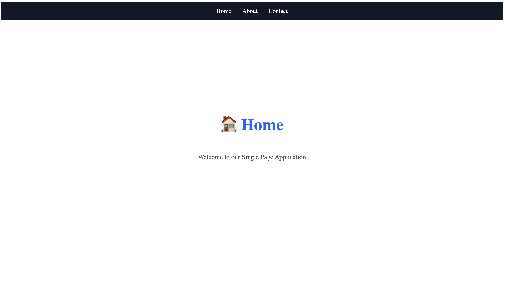
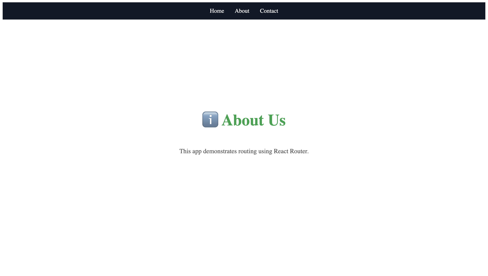
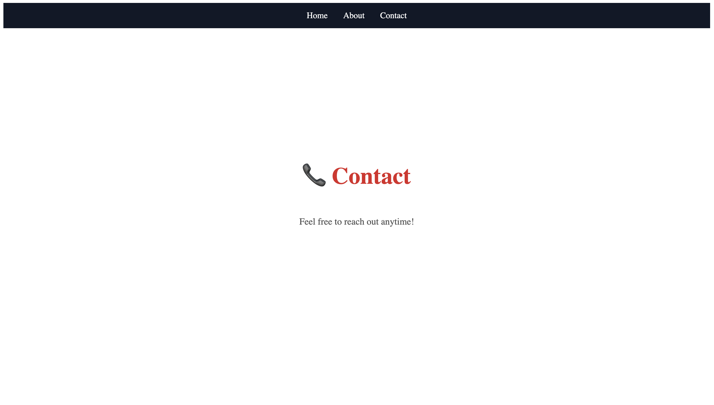

# 📘 Experiment Learnings

- In this experiment, I learned how to build a basic Single Page Application (SPA) using React. I understood how routing works in React with the help of React Router, which allows navigation between different pages without refreshing the browser.

- I also learned the difference between SPA and MPA. In an MPA, each page request reloads the entire page from the server, while in an SPA, only the required content is updated, resulting in better performance and smoother user experience.

- A dditionally, I gained an understanding of client-server architecture, where the client sends requests and the server processes them and sends back responses. This helped me understand how frontend applications communicate with the backend.

- Overall, this experiment improved my understanding of React routing, component structure, and modern web application architecture.

## Deployed Link : https://fsd-2-4b6u.onrender.com

# Screenshots :

