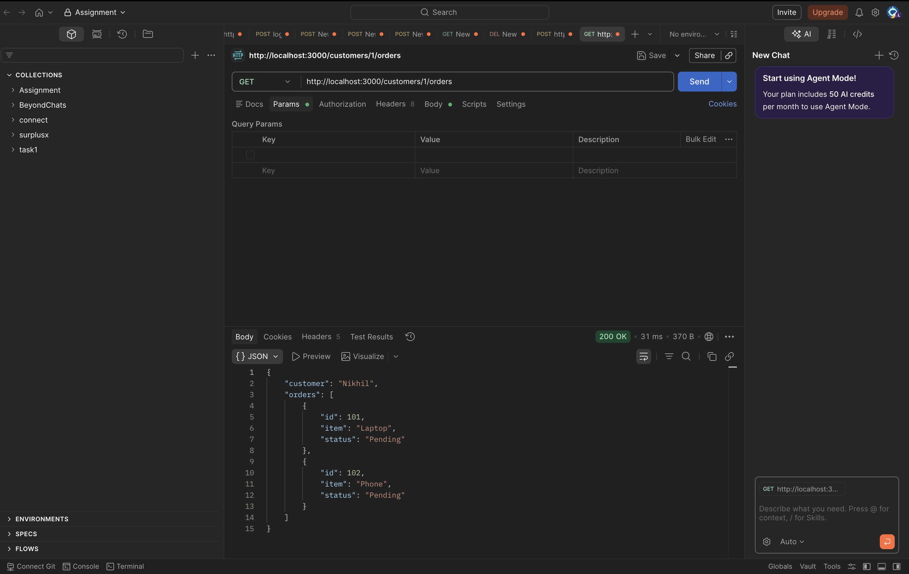
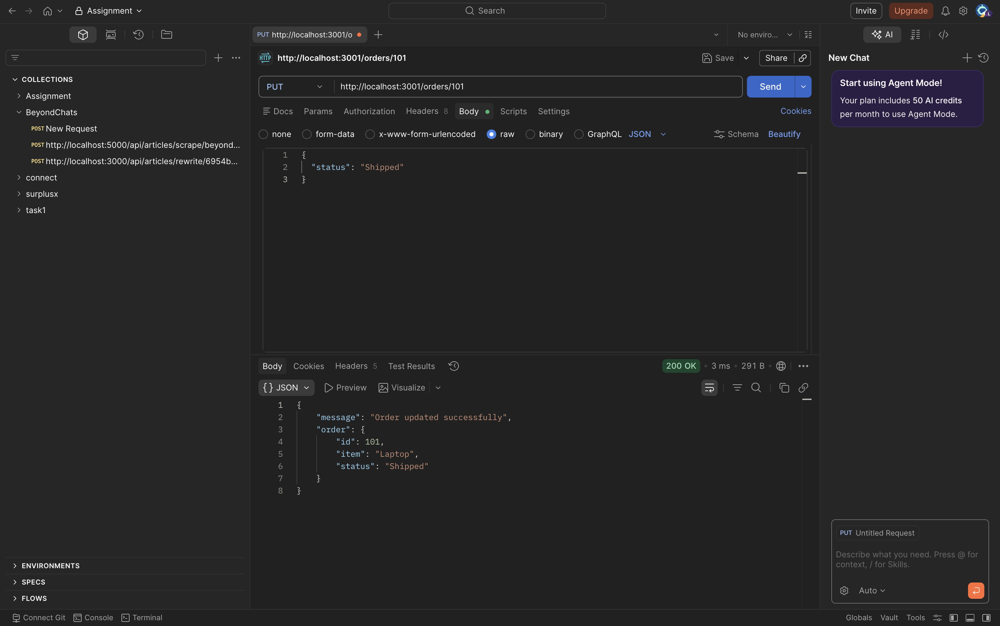
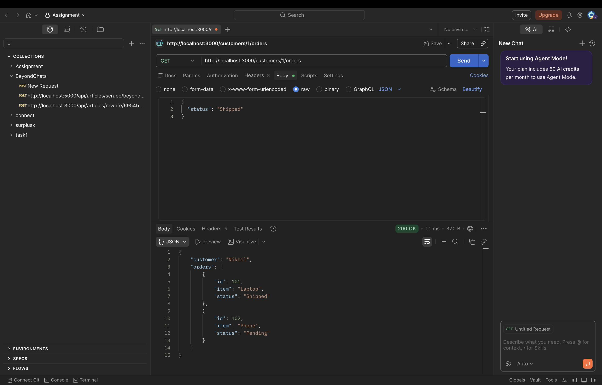

# 📘 Learning Outcomes
- Understood the concept of microservices architecture and how independent services interact with each other.
- Learned to build RESTful APIs using Python Flask, including handling different HTTP methods like GET and PUT.
- Gained knowledge of inter-service communication using HTTP requests between microservices.
- Explored in-memory data storage using Python data structures instead of a database.
- Developed skills in API testing and debugging using tools like Postman.

# Screenshots

