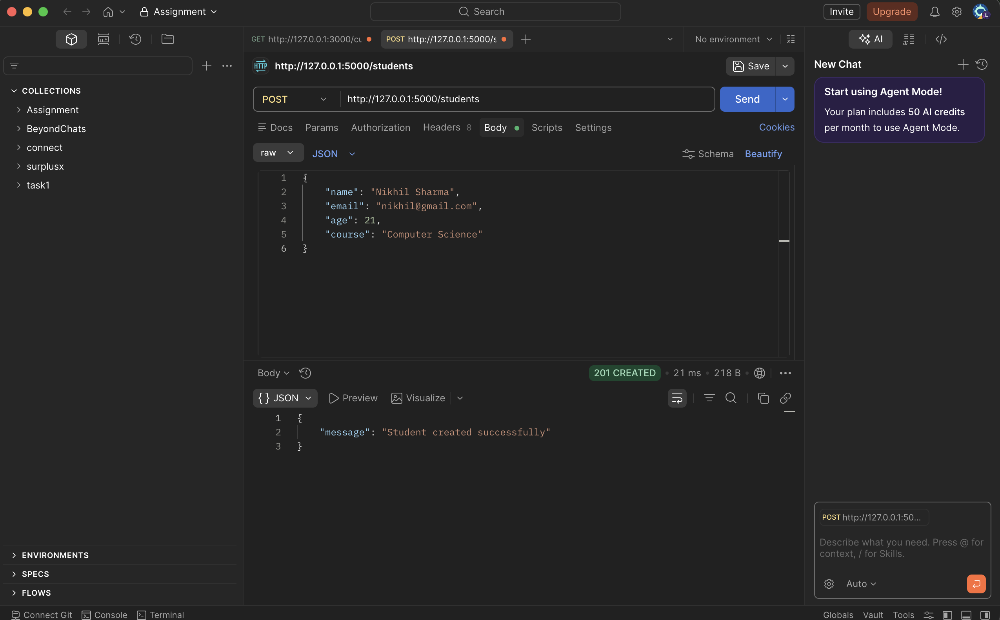
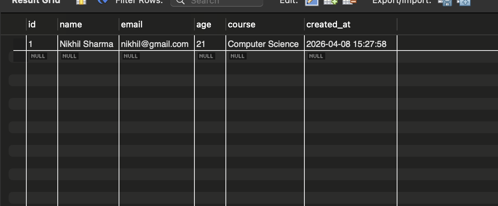
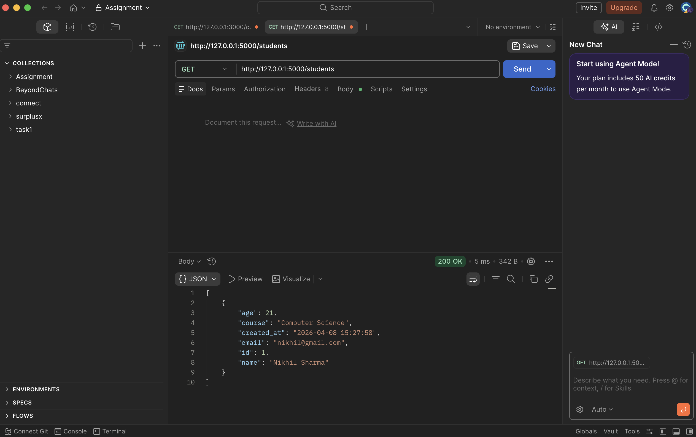
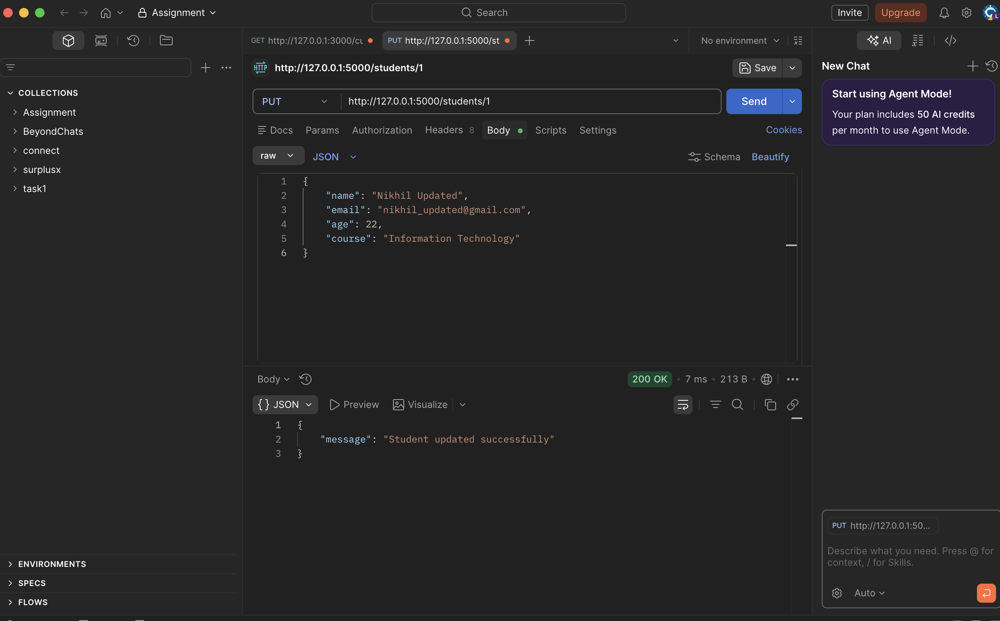
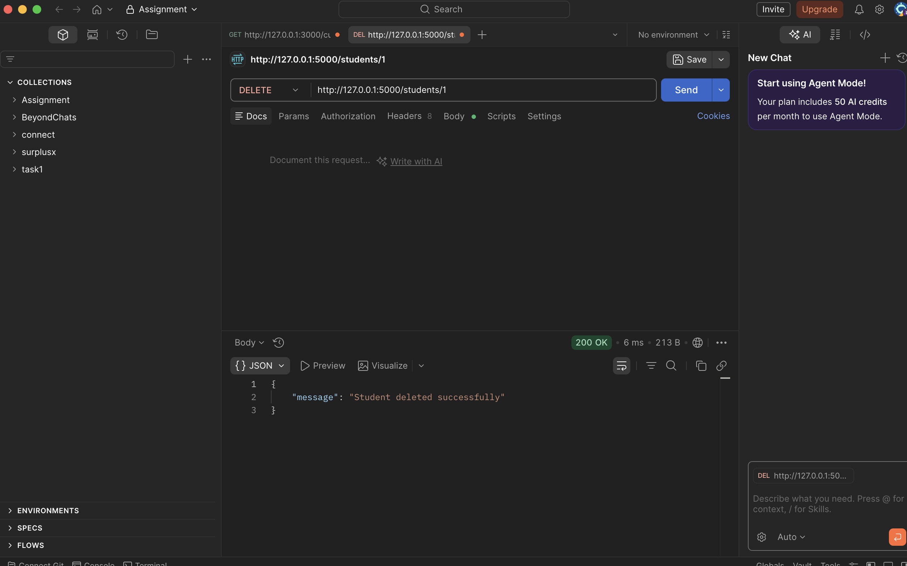
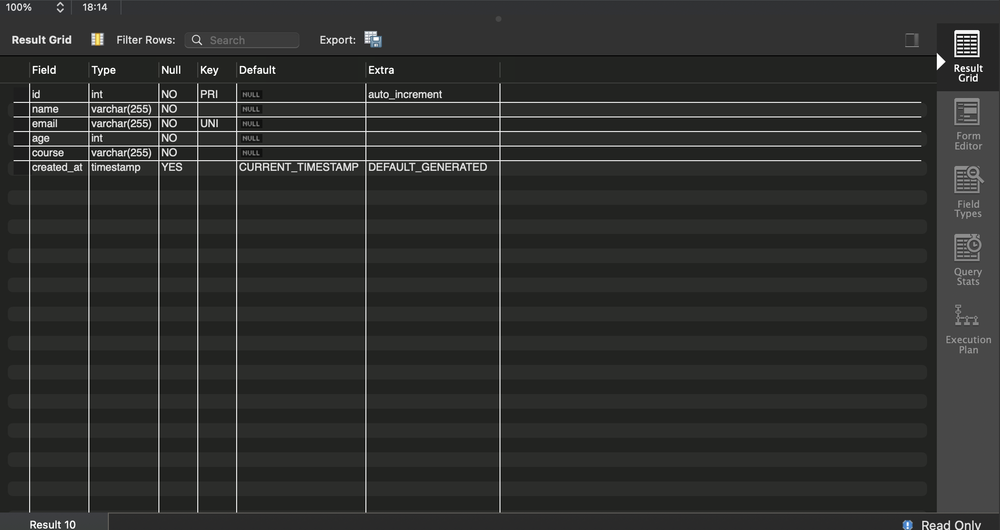

# Learning Outcomes
- Performing CRUD Operations
Developed the ability to implement operations for adding, retrieving, updating, and deleting student records.
- Backend API Development Skills
Gained experience in creating REST APIs using Flask to handle client-server communication.
- Testing and Verification of APIs
Practiced testing endpoints using Postman and automated testing tools like pytest to ensure correctness of the application.
- Working with Databases
Learned how to integrate a MySQL database with a backend application and manage persistent data.
- Data Validation and Exception Handling
Understood how to validate incoming data and manage errors using proper response messages and status codes.

# Screenshots:

