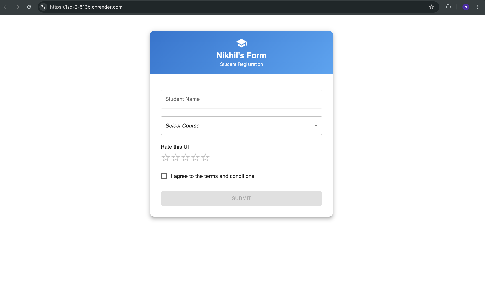

# 📘 Experiment Learnings

- In this experiment, I learned how to design a user interface using a component library in React, specifically Material UI. I implemented five commonly used UI components: Button, TextField, Select, Rating, and Checkbox, which are essential for building interactive and user-friendly forms in modern web applications.

- Through this experiment, I understood how pre-built UI components help in faster development, consistent design, and better user experience. I learned how to customize components using props and styling options, such as colors, sizes, and layout, to create a professional-looking form interface.

- I also gained hands-on experience with React state management using the useState hook to handle user interactions like selecting options, giving ratings, and toggling checkboxes. This helped me understand how UI components respond dynamically to user input in real time.

- Additionally, I learned how to structure components using Material UI’s layout utilities such as Container, Box, and Paper to create a clean and responsive layout that works well across different screen sizes.

- Overall, this experiment enhanced my understanding of component-based UI design, React state handling, and the importance of reusable UI components in building scalable and maintainable frontend applications.

Deployed Link : https://23bcc70030-experiment-2.netlify.app/

Screenshots :

