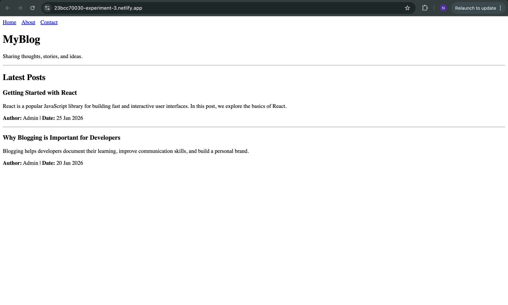
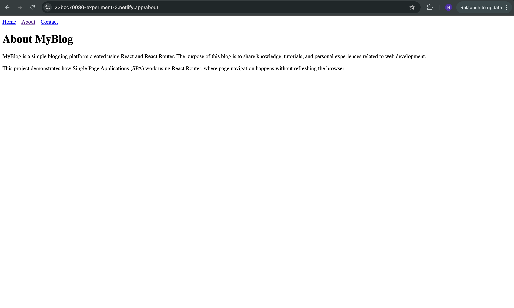
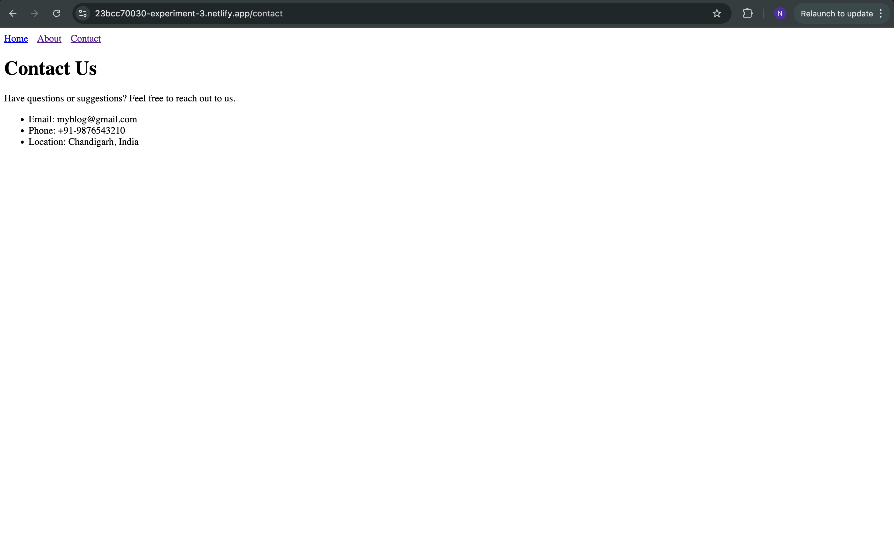

# Learnings from the Experiment

- Understanding Single Page Applications (SPA)
Learned how React Router enables Single Page Application behavior by updating the UI without reloading the browser, resulting in faster navigation and better user experience.

- Implementation of Client-Side Routing
Understood how BrowserRouter, Routes, and Route work together to map different URLs (Home, About, Contact Us) to their respective components in a React application.

- Navigation Using Link Component
Learned how the Link component provides smooth navigation between pages without refreshing the page, unlike traditional HTML anchor tags.

- Component-Based Architecture in React
Gained hands-on experience in building a blogging website using separate and reusable components, improving code readability and maintainability.

- Version Control and Rebasing with Git
Learned how to rebase the local branch with the remote origin branch using Git, which helps keep the commit history clean and up to date with the latest changes from the remote repository.

# Screenshots

### Home

### About

### Contact
