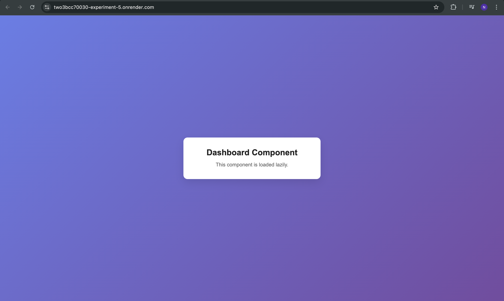

# Learning Outcomes

- Understood how React.lazy() and Suspense enable code splitting and improve application performance by loading components only when required.

- Learned how to implement a fallback UI using Suspense to enhance user experience while lazily loaded components are being fetched.

- Gained practical knowledge of linking and organizing CSS in a React (Vite) project, including global styles and component-level styling.

- Understood the correct way to style the HTML body in React applications using CSS imports instead of directly linking styles in index.html.

- Developed awareness of best practices in React project structure, such as separating concerns between logic, presentation, and global configuration.

ScreenShot:
