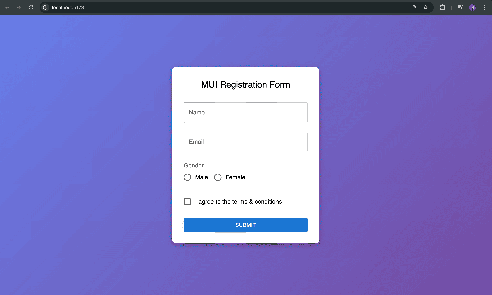

#Learning Outcomes:
 - Learned to build a fully functional form using Material UI components such as TextField, Radio buttons, Checkboxes, and Buttons in a React application.

- Gained hands-on experience in implementing client-side form validation, including required field checks, email format validation, and conditional submission.

- Understood how to apply global CSS resets (margin: 0, padding: 0) to eliminate default browser styling issues like unwanted white gaps.

- Learned to design a responsive and visually appealing UI using MUI’s Box component, gradients, and card-based layouts.

- Developed understanding of best practices in React form handling, including state management with useState, controlled components, and clean separation of logic and UI.
# Screenshots
