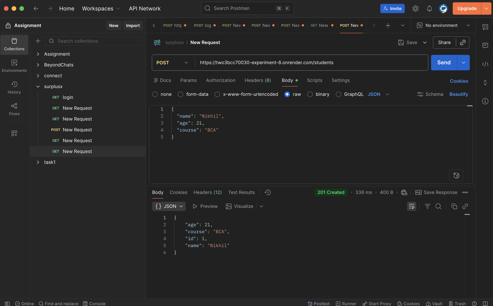
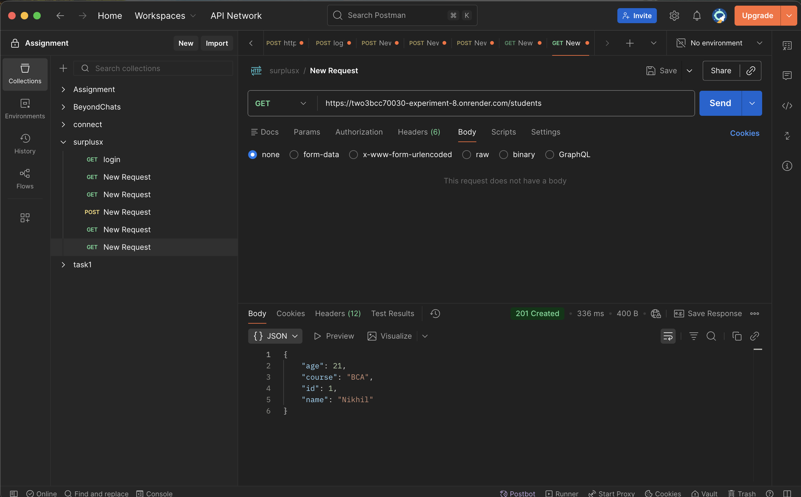
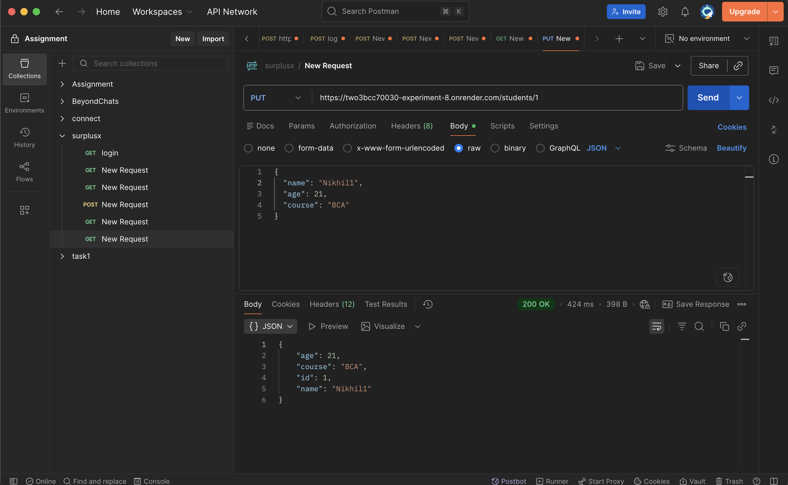
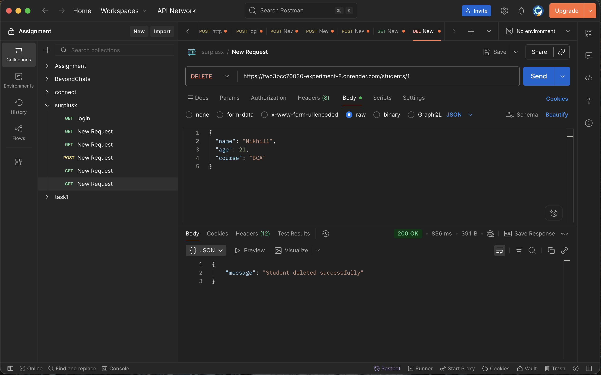

# 🎯 Learning Outcomes

- Understand REST Architecture
Students will understand the concept of RESTful APIs, HTTP methods (GET, POST, PUT, DELETE), and how client-server communication works.

- Develop Backend Using Flask
Students will be able to create a backend server using the Python Flask framework.

- Implement CRUD Operations
Students will learn how to implement Create, Read, Update, and Delete (CRUD) operations using API endpoints.

- Work with In-Memory Data Storage
Students will understand how to store and manage data temporarily using in-memory arrays without a database.

- Test and Deploy APIs
Students will gain experience in testing APIs using Postman and deploying backend applications on cloud platforms like Render.

# ScreenShots: 

