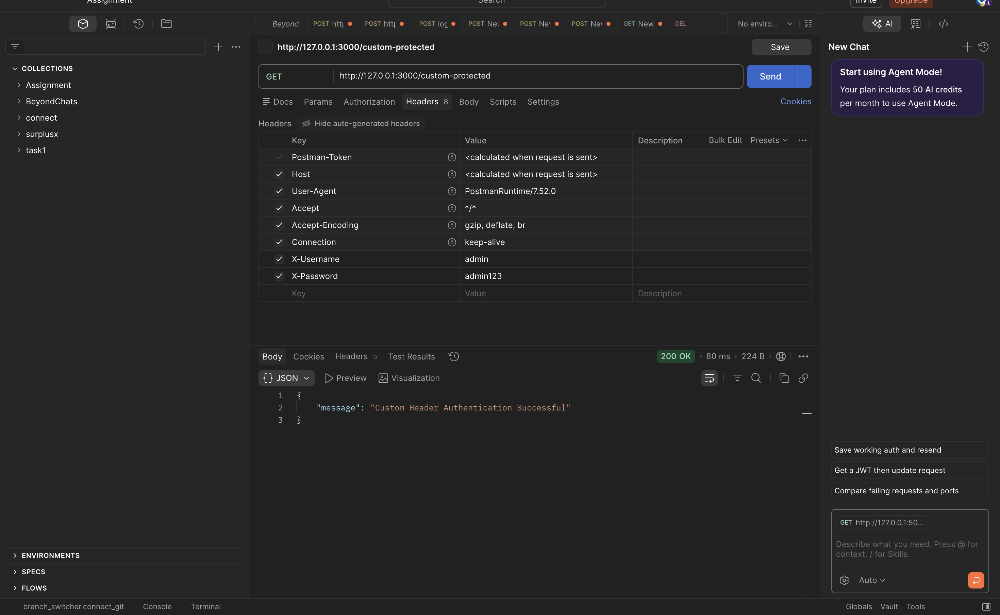
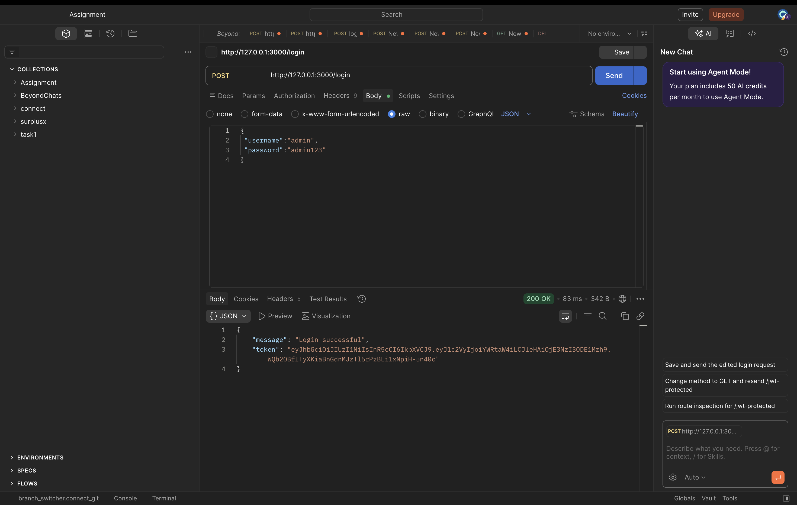
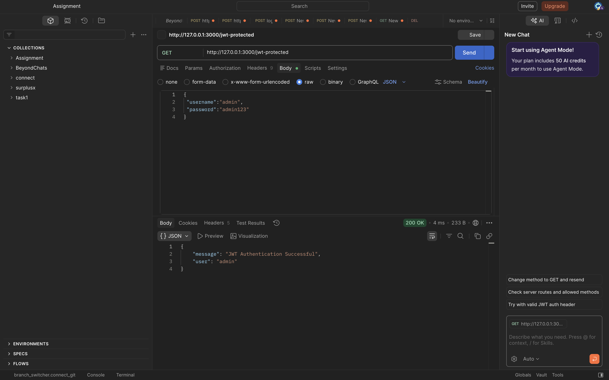

# Learning Outcomes : 
- Understanding Token-Based Authentication
Learned how token-based authentication works and how it helps secure APIs by verifying user identity before granting access to protected resources.

- Implementation of Basic Authentication
Implemented authentication using the Authorization header (Basic Auth) and understood how credentials are encoded and validated on the server.

- Using Custom Headers for Authentication
Gained experience in sending and validating custom headers (X-Username and X-Password) to authenticate API requests.

- JWT Token Generation and Verification
Implemented JSON Web Token (JWT) authentication, including generating tokens during login and verifying them to access protected routes.

- API Testing Using Postman
Learned how to test secured APIs using Postman, including sending headers, JSON body data, and bearer tokens for authentication.

# Screenshots :

